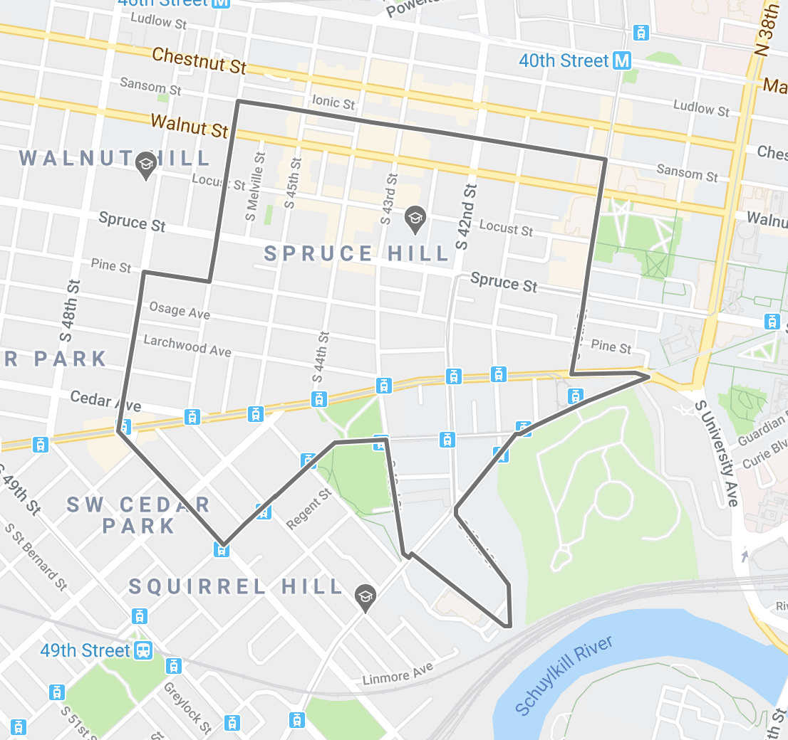
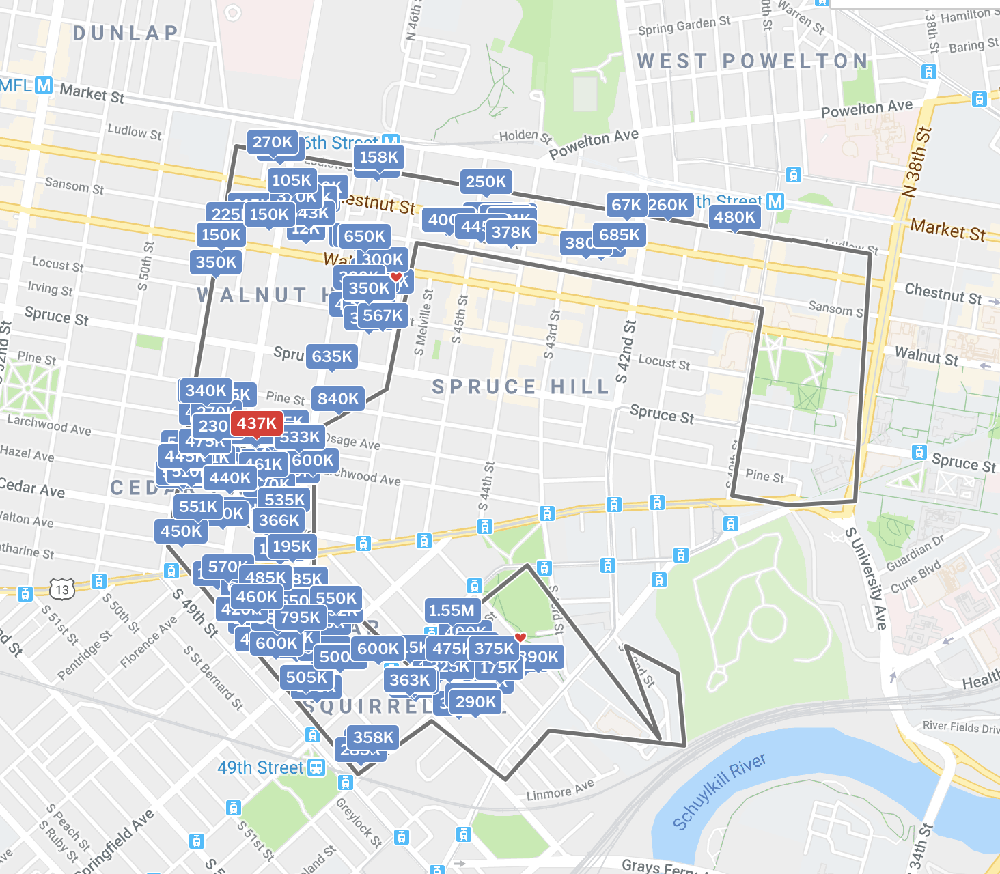

# Descriptive Analysis
Below are the maps of the areas that are being compared.  The data was scrapped from redfin.com.  Filters were set to capture the following variables:  Price.Sold (how much the house was sold for), Bed (number of bedrooms), Bath (number of bathrooms), sqft (square footage of house), catchment (1 = inside PAS catchment / 0 = outside of catchment).  The data is for the last 3 years.  There are a total of 397 observations (197 inside the catchment and 200 outside the catchment).  

{width=50%} 

{width=50%}

**Figure 1**
Summary command to compare in and out of catchment.
```{r}
summary(Price.Sold[catchment=="0"])

summary(Price.Sold[catchment=="1"])
```
**Figure 2**
Welch's 2 Sample t test to compare the two samples.  
```{r}
t.test(Price.Sold~catchment)
```

**Figure 3**
Boxplot of data to visualize the two groups and compare Price.Sold
```{r}
boxplot(Price.Sold ~ catchment, main="Boxplot Price.Sold In and Out of Catchment", ylab="Price.Sold", xlab="Catchment")
```

**Figure 4**
Boxplot of data comparing sqft between the 2 groups
```{r}
boxplot(sqft ~ catchment, main="Boxplot of Sqft of Property In and Out of Catchment", ylab ="sqft", xlab ="Catchment")
```

**Figure 5**
Correlation test to see how explanatory variables compare.  Correlation was highest for this pair.
```{r}
cor(Bed,sqft)
```

