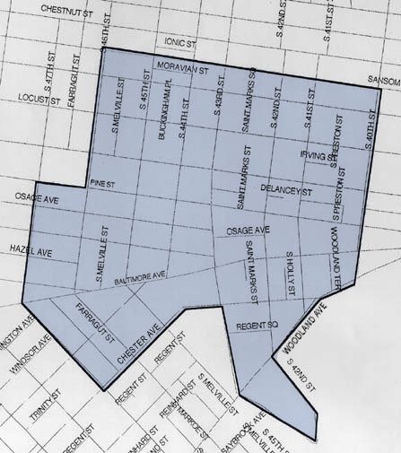

My family and I have lived in West Philadelphia for 3 years now.  We love the neighborhood because of it's proximity to work and our kids' school.  The neighborhood is also our source for social interactions with friends that we've gotten to know through the local daycare and through the local public school.  With assistance from the University of Pennsylvania, this local public school (PAS) was established in 2001 .  The area surrounding the school has changed significantly over the last 17 years.  I've been interested in how the presence of the school has affected housing prices within the school's catchment compared to the houses outside of the catchment.  The official catchment map can be found below.

{width=50%}

While helping to financially create a public school for the local community seems like a good thing to do, the effects of creating it, lead to opportunities from some and problems for others.  Issues of gentrification and the lack of affordable housing have been affecting local residents.  A recent article below highlights some of what local residents are going through because of the immediate housing market change.
http://www2.philly.com/philly/news/penn-alexander-university-city-west-philly-low-income-affordable-housing-20181101.html

When researching other articles about housing prices, I wanted to see which variables they used to decide how to valuate housing costs.  Explanatory variables such as square footage, number of rooms, parking, elevators, age of property were used to determine the price of homes.  I will discuss which variables I chose for this project in the Data and Methods section.
When do better schools raise housing prices? Evidence from Paris public and private schools https://proxy.library.upenn.edu:2067/science/article/pii/S0047272709001388

I would like to explore and analyze data from https://redfin.com to better understand how houses in the catchment compare with houses outside the catchment.  My hypothesis is that there is no difference in the mean price between the two groups of properties.  My feeling is that we will find information to the contrary, but I don't know whether that difference is attributed to being in the catchment or other variables.  I would also like to know if the difference is statistically significant or not.

 